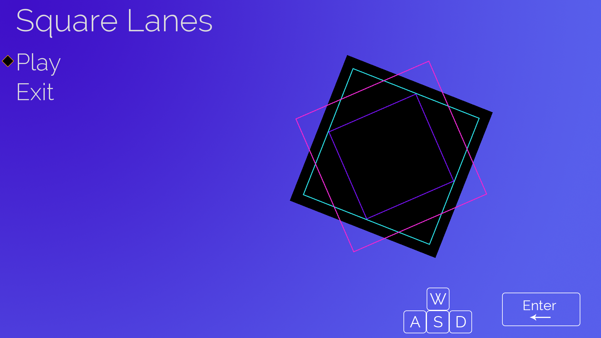
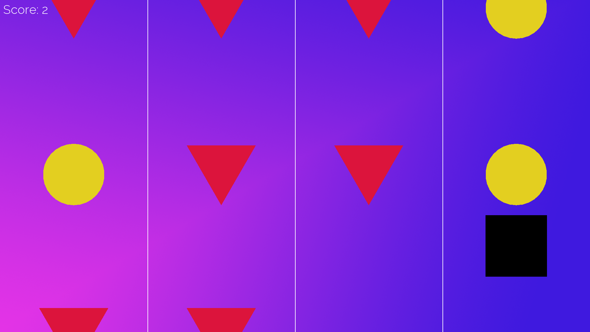

# PA9
CptS 122: Programming Assignment 9

## Square Lanes

### Premise
The game is called *Square Lanes*.
You play as a square that has to move horizontally between 4 lanes while collecting coins for score and avoiding spikes that if touched, will result in a game over.
The speed of the game increases as time goes on, making the game more difficult the longer you survive.

### Main Menu

Navigate the main menu using **W** to go up and **S** to go down.
Press **Enter** to select an option in the menu.

### Gameplay

Move left using **A** and move right using **D**.
Collect the coins and avoid the spikes.
The game doesn't end until you hit a spike.
Try to get the highest score possible.

## Credits

### Authors
* Alex Carbajal: Lab Section 03
* Francesco Rachetto: Lab Section 09
* Brendan Nelson: Lab Section 02

### Music
* Aphex Twin - Luke Vibert spiral staircase (AFX remix)
* Alec Holowka - Rapture